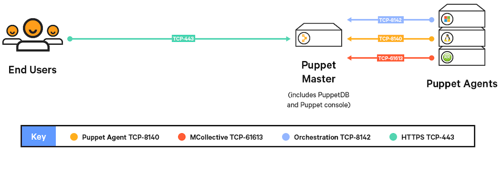
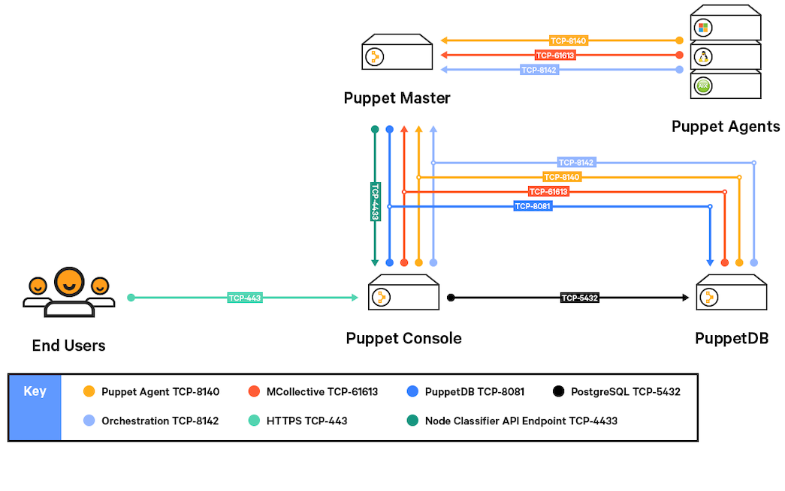
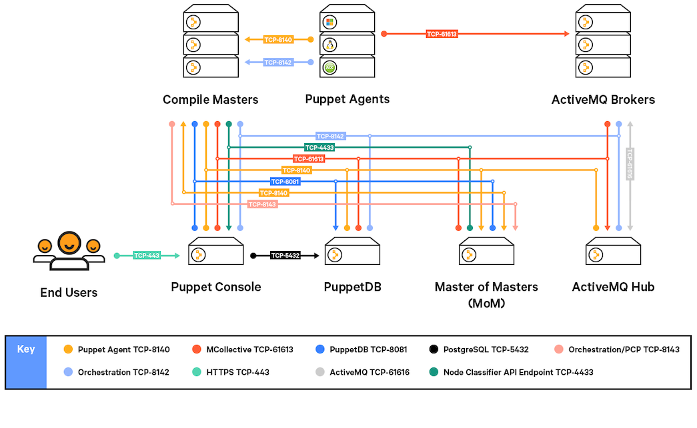

# System configuration

Before installing Puppet Enterprise, make sure that your nodes and network are properly configured.

**Note:** Port numbers are Transmission Control Protocols \(TCP\), unless noted otherwise.

## Timekeeping and name resolution

Before installing , there are network requirements you need to consider and prepare for. The most important requirements include syncing time and creating a plan for name resolution.

### Timekeeping

Use NTP or an equivalent service to ensure that time is in sync between your master, which acts as the certificate authority, and any agent nodes. If time drifts out of sync in your infrastructure, you might encounter issues such as agents recieving outdated certificates. A service like NTP \(available as a supported module\) ensures accurate timekeeping.

### Name resolution

Decide on a preferred name or set of names that agent nodes can use to contact the master. Ensure that the master can be reached by domain name lookup by all future agent nodes.

You can simplify configuration of agent nodes by using a CNAME record to make the master reachable at the hostname `puppet`, which is the default master hostname that is suggested when installing an agent node.

## Web URLs used for deployment and management

PE uses some external web URLs for certain deployment and management tasks. You might want to ensure these URLs are reachable from your network prior to installation, and be aware that they might be called at various stages of configuration.

|URL|Enables|
|---|-------|
|[forgeapi.puppet.com](http://forgeapi.puppet.com/)|Puppet module downloads.|
|[pm.puppetlabs.com](http://pm.puppetlabs.com/)|Agent module package downloads.|
|[s3.amazonaws.com](http://s3.amazonaws.com/)|Agent module package downloads \(redirected from pm.pupptlabs.com\).|
|[rubygems.org](http://rubygems.org/)|Puppet and Puppet Server gem downloads.|
|[github.com](http://github.com/)|Third-party module downloads not served by the Forge and access to control repositories.|

## Firewall configuration for monolithic installations

These are the port requirements for monolithic installations.

|Port|Use|
|----|---|
|8140|-   The master uses this port to accept inbound traffic/requests from agents.

-   The console sends requests to the master on this port.

-   Certificate requests are passed over this port unless `ca_port` is set differently.

-   Puppet Server status checks are sent over this port.

-   Classifier group: **PE Master**

|
|443|-   This port provides host access to the console

-   The console accepts HTTPS traffic from end users on this port.

-   Classifier group: **PE Console**

|
|61613|-   MCollective uses this port to accept inbound traffic/requests from agents.

-   Any host used to invoke commands must be able to reach MCollective on this port.

-   Classifier group: **PE ActiveMQ Broker**

|
|8142|-   Orchestrator and the **Run Puppet** button use this port on the master of masters to accept inbound traffic/responses from agents via the Puppet Execution Protocol agent.

-   Classifier group: **PE Orchestrator**

|

## Firewall configuration for monolithic installations with compile masters

These are the port requirements for monolithic installations with compile masters.

|Port|Use|
|----|---|
|8140|-   The master uses this port to accept inbound traffic/requests from agents.

-   The console sends requests to the master on this port.

-   Certificate requests are passed over this port unless `ca_port` is set differently.

-   Puppet Server status checks are sent over this port.

-   The master uses this port to send status checks to compile masters. \(Not required to run PE.\)

-   Classifier group: **PE Master**

|
|443|-   This port provides host access to the console

-   The console accepts HTTPS traffic from end users on this port.

-   Classifier group: **PE Console**

|
|61613|-   MCollective uses this port to accept inbound traffic/requests from agents.

-   Any host used to invoke commands must be able to reach MCollective on this port.

-   Classifier group: **PE ActiveMQ Broker**

|
|4433|-   This port is used as a classifier / console services API endpoint.

-   The master communicates with the console over this port.

-   Classifier group: **PE Console**

|
|8081|-   PuppetDB accepts traffic/requests on this port.

-   The master and console send traffic to PuppetDB on this port.

-   PuppetDB status checks are sent over this port.

-   Classifier group: **PE PuppetDB**

|
|8142|-   Orchestrator and the **Run Puppet** button use this port on the master of masters to accept inbound traffic/responses from agents via the Puppet Execution Protocol agent.

-   Classifier group: **PE Orchestrator**

|
|8143|-   Orchestrator uses this port to accept connections from Puppet Communications Protocol brokers to relay communications. The orchestrator client also uses this port to communicate with the orchestration services running on the master of masters. If you install the client on a workstation, this port must be available on the workstation.

-   Classifier group: **PE Orchestrator**

|

## Firewall configuration for split installations

These are the port requirements for split installations.

|Port|Use|
|----|---|
|8140|-   The master uses this port to accept inbound traffic/requests from agents.

-   The console sends requests to the master on this port.

-   Certificate requests are passed over this port unless `ca_port` is set differently.

-   Puppet Server status checks are sent over this port.

-   In a large environment installation, the master uses this port to send status checks to compile masters. \(Not required to run PE.\)

-   Classifier group: **PE Master**

|
|443|-   This port provides host access to the console

-   The console accepts HTTPS traffic from end users on this port.

-   Classifier group: **PE Console**

|
|61613|-   MCollective uses this port to accept inbound traffic/requests from agents.

-   Any host used to invoke commands must be able to reach MCollective on this port.

-   Classifier group: **PE ActiveMQ Broker**

|
|4433|-   This port is used as a classifier / console services API endpoint.

-   The master communicates with the console over this port.

-   Classifier group: **PE Console**

|
|8081|-   PuppetDB accepts traffic/requests on this port.

-   The master and console send traffic to PuppetDB on this port.

-   PuppetDB status checks are sent over this port.

-   Classifier group: **PE PuppetDB**

|
|8142|-   Orchestrator and the **Run Puppet** button use this port on the master of masters to accept inbound traffic/responses from agents via the Puppet Execution Protocol agent.

-   Classifier group: **PE Orchestrator**

|
|8143|-   Orchestrator uses this port to accept connections from Puppet Communications Protocol brokers to relay communications. The orchestrator client also uses this port to communicate with the orchestration services running on the master of masters. If you install the client on a workstation, this port must be available on the workstation.

-   Classifier group: **PE Orchestrator**

|
|5432|-   PostgreSQL runs on this port.

-   The console node needs to connect to the PuppetDB node hosting the PostgreSQL database on this port.

-   Classifier group: **PE PuppetDB**

|
|61616|-   This port is used for ActiveMQ hub and spoke communication.

-   Classifier group: **PE ActiveMQ Broker**

|

## Firewall configuration for large environment installations

The port requirements for large environment installation are the same as those for split installation.

## Port usage for all installation types

In addition to installation-specific firewall configuration, some features and tools have specific port requirements.

-   Port **3000**: If you are installing using the web-based installer, in either a split or a mono configuration, ensure port 3000 is open. You can close this port when the installation is complete. Instructions for port forwarding to the web-based installer are included in the installation instructions.

-   Port **8150** and **8151**: Razor uses port 8150 for HTTP and 8151 for HTTPS. Any node classified as a Razor server must be able to use these ports.

-   Port **4432**: Local connections for the node classifier, activity service, and RBAC status checks are sent over this port. Remote connections should use port **4433**.

-   Port **8170**: Code Manager uses this port to deploy environments, run webhooks, and make API calls.

