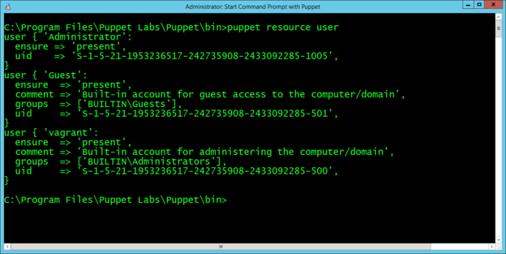
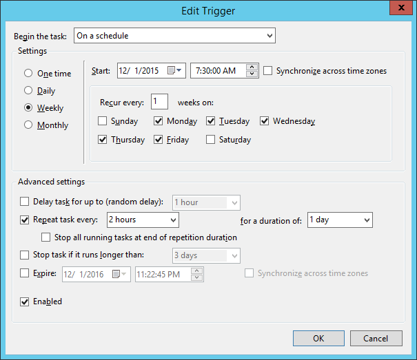
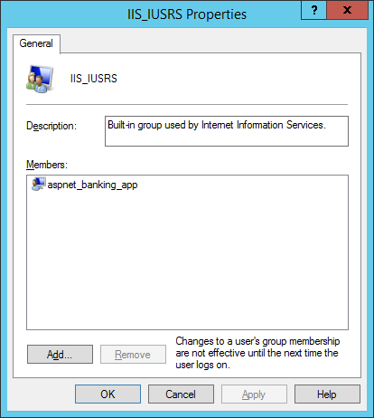

# Managing Windows configurations

This page covers the different ways you can use Puppet Enterprise \(PE\) to manage your Windows configurations, including creating local group and user accounts.

## Basic tasks and concepts in Windows

This section is meant to help familiarize you with several common tasks used in Puppet Enterprise \(PE\) with Windows agents, and explain the concepts and reasons behind performing them.

### Practice tasks

In other locations in the documentation, these can be found as steps in tasks, but they are not explained as thoroughly.

#### Write a simple manifest

Puppet manifest files are lists of resources that have a unique title and a set of named attributes that describe the desired state.

##### Before you begin

You need a text editor to create manifest files. Atom, Visual Studio Code and Sublime Text support syntax highlighting of the Puppet language. Editors like Notepad++ or Notepad won't highlight Puppet syntax, but can also be used to create manifests.

##### About this task

Manifest files are written in Puppet code, a domain specific language \(DSL\) that defines the desired state of resources on a system, such as files, users, and packages. Puppet compiles these text-based manifests into catalogs, and uses those to apply configuration changes.

##### Procedure

1.  Create a file named `file.pp` and save it in `c:\myfiles\`

2.  With your text editor of choice, add the following text to the file:

    ```
    file { 'c:\\Temp\\foo.txt':
      ensure   => present,
      content  => 'This is some text in my file'
    }
    ```


##### Results

Note the following details in this file resource example:

-   Puppet uses a basic syntax of `type { title: }`, where `type` is the resource type — in this case it’s `file`.

-   The resource title \(the value before the `:`\) is `C:\\Temp\\foo.txt`. The file resource uses the title to determine where to create the file on disk. A resource title must always be unique within a given manifest.

-   The `ensure` parameter is set to `present` to create the file on disk, if it's not already present. For `file` type resources, you can also use the value `absent`, which removes the file from disk if it exists.

-   The `content` parameter is set to `This is some text in my file`, which writes that value to the file.


#### Validate your manifest with `puppet parser validate`

You can validate that a manifest's syntax is correct by using the command `puppet parser validate`

##### Procedure

1.  Check your syntax by entering `puppet parser validate c:\myfiles\file.pp` in the Puppet command prompt. If a manifest has no syntax errors, the tool outputs nothing.

2.  To see what output occurs when there is an error, temporarily edit the manifest and remove the `:` after the resource title. Run `puppet parser validate c:\myfiles\file.pp` again, and see the following output:

    ```
    Error: Could not parse for environment production: Syntax error at 'ensure' at c:/myfiles/file.pp:2:3
    ```


#### Launch the Puppet command prompt

A lot of common interactions with Puppet are done via the command line.

##### Procedure

1.  To open the command line interface, enterCommand Prompt Puppet in your **Start Menu**, and click **Start Command Prompt with Puppet**.


##### Results

The Puppet command prompt has a few details worth noting:

-   Several important batch files live in the current working directory, `C:\Program Files\Puppet Labs\Puppet\bin`. The most important of these batch files is `puppet.bat`. Puppet is a Ruby based application, and `puppet.bat` is a wrapper around executing Puppet code through `ruby.exe`.
-   Running the command prompt with Puppet rather than just the default Windows command prompt ensures that all of the Puppet tooling is in PATH, even if you change to a different directory.


#### Simulate a Puppet run with `--noop`

Puppet has a switch that you can use to test if manifests make the intended changes. This is referred to as non-enforcement or no-op mode.

##### Procedure

1.  To simulate changes, run `puppet apply c:\myfiles\file.pp --noop` in the command prompt:

    ```
    C:\Program Files\Puppet Labs\Puppet\bin>puppet apply c:\myfiles\file.pp --noop
    Notice: Compiled catalog for win-User.localdomain in environment production in 0.45 seconds
    Notice: /Stage[main]/MainFile[C:\Temp\foo.txt]/ensure: current value absent, should be present (noop)
    Notice: Class[Main]: Would have triggered 'refresh' from 1 events
    Notice: Stage[main]: Would have triggered 'refresh' from 1 events
    Notice: Applied catalog in 0.03 seconds
    ```


##### Results

Puppet shows you the changes it *would* make, but does not actually make the changes. It *would* create a new file at `C:\Temp\foo.txt`, but it hasn't, because you used `--noop`.

#### Enforce the desired state with `puppet apply`

When the output of the simulation shows the changes you intend to make, you can start enforcing these changes with the `puppet apply` command.

##### Procedure

1.  Run `puppet apply c:\myfiles\file.pp`.

    To see more details about what this command did, you can specify additional options, such as `--trace`, `--debug`, or `--verbose`, which can help you diagnose problematic code. If `puppet apply` fails, Puppet outputs a full stack trace.


##### Results

Puppet enforces the resource state you've described in `file.pp`, in this case guaranteeing that a file \(`c:\Temp\foo.txt`\) is present and has the contents `This is some text in my file`.

### Understanding idempotency

A key feature of Puppet is its *idempotency*: the ability to repeatedly apply a manifest to guarantee a desired resource state on a system, with the same results every time.

If a given resource is already in the desired state, Puppet performs no actions. If a given resource is not in the desired state, Puppet takes whatever action is necessary to put the resource into the desired state. Idempotency enables Puppet to simulate resource changes without performing them, and lets you set up configuration management one time, fixing configuration drift without recreating resources from scratch each time Puppet runs.

To demonstrate how Puppet can be applied repeatedly to get the same results, change the manifest at `c:\myfiles\file.pp` to the following:

```
file { 'C:\\Temp\\foo.txt':
  ensure   => present,
  content  => 'I have changed my file content.'
}
```

Apply the manifest by running `puppet apply c:\myfiles\file.pp`. Open `c:\Temp\foo.txt` and notice that Puppet changes the file's contents.

Applying the manifest again with `puppet apply c:\myfiles\file.pp` results in no changes to the system, demonstrating that Puppet behaves idempotently.

Many of the samples in Puppet documentation assume that you have this basic understanding of creating and editing manifest files, and applying them with `puppet apply`.

### Additional command line tools

Once you understand how to write manifests, validate them, and use `puppet apply` to enforce your changes, you're ready to use commands such as `puppet agent`, `puppet resource`, and `puppet module install`.

#### puppet agent

Like `puppet apply`, the `puppet agent` command line tool applies configuration changes to a system. However, `puppet agent` retrieves compiled catalogs from a Puppet Server, and applies them to the local system. Puppet is installed as a Windows service, and by default tries to contact the master every 30 minutes by running `puppet agent` to retrieve new catalogs and apply them locally.

#### puppet resource

You can run `puppet resource` to query the state of a particular type of resource on the system. For example, to list all of the users on a system, run the command `puppet resource user`.



The computer used for this example has three local user accounts: Administrator, Guest, and vagrant. Note that the output is the same format as a manifest, and you can copy and paste it directly into a manifest.

#### puppet module install

Puppet includes many core resource types, plus you can extend Puppet by installing modules. Modules contain additional resource definitions and the code necessary to modify a system to create, read, modify, or delete those resources. The Puppet Forge contains modules developed by Puppet and community members available for anyone to use.

Puppet synchronizes modules from a master to agent nodes during `puppet agent` runs. Alternatively, you can use the standalone Puppet module tool, included when you install Puppet, to manage, view, and test modules.

Run `puppet module list` to show the list of modules installed on the system.

To install modules, the Puppet module tool uses the syntax `puppet module install NAMESPACE/MODULENAME`. The `NAMESPACE` is registered to a module, and `MODULE` refers to the specific module name. A very common module to install on Windows is `registry`, under the `puppetlabs` namespace. So, to install the `registry` module, run `puppet module install puppetlabs/registry`.

## Manage Windows services

You can use Puppet to manage Windows services, specifically, to start, stop, enable, disable, list, query, and configure services. This way, you can ensure that certain services are always running or are disabled as necessary.

### About this task

You write Puppet code to manage services in the manifest. When you apply the manifest, the changes you make to the service are applied.

**Note:** In addition to using manifests to apply configuration changes, you can query system state using the `puppet resource` command, which emits code as well as applying changes.

### Ensure a Windows service is running

There are often services that you always want running in your infrastructure.

#### Procedure

1.  To have Puppet ensure that a service is running, use the following code:

    ```
    service { '<service name>':
           ensure => 'running'
        }
    ```


#### Example

For example, the following manifest code ensures the  Windows Time service is running:

```
service { 'w32time':
  ensure => 'running'
}
```

### Stop a Windows service

Some services can impair performance, or might need to be stopped for regular maintenance.

#### Procedure

1.  To disable a service, use the code:

    ```
    service { '<service name>':
       ensure => 'stopped',
       enable => 'false'
    }
    ```


#### Example

For example, this disables the disk defragmentation service, which can negatively impact service performance.

```
 service { 'defragsvc':
  ensure => 'stopped',
  enable => 'false'
}
```

### Schedule a recurring task

Regularly scheduled tasks are often necessary on Windows to perform routine system maintenance.

#### About this task

If you need to sync files from another system on the network, perform backups to another disk, or execute log or index maintenance on SQL Server, you can use Puppet to schedule and perform regular tasks. The following shows how to regularly delete files.

#### Procedure

1.  To delete all files recursively from `C:\Windows\Temp` at 8 AM each day, create a resource called `scheduled_task` with these attributes:

    ```
    scheduled_task { 'Purge global temp files':
       ensure    => present,
       enabled   => true,
       command   => 'c:\\windows\\system32\\cmd.exe',
       arguments => '/c "del c:\\windows\\temp\\*.* /F /S /Q"',
       trigger   => {
          schedule   => daily,
          start_time => '08:00',
      }
    }
    ```


#### Results

After you set up Puppet to manage this task, the Task Scheduler includes the task you specified:


#### Example

In addition to creating a trivial daily task at a specified time, the scheduled task resource supports a number of other more advanced scheduling capabilities, including more fine-tuned scheduling. For example, to change the above task to instead perform a disk clean-up every 2 hours, modify the trigger definition:

```
scheduled_task { 'Purge global temp files every 2 hours':
   ensure  => present,
   enabled => true,
   command   => 'c:\\windows\\system32\\cmd.exe',
   arguments => '/c "del c:\\windows\\temp\\*.* /F /S /Q"',
   trigger => [{
      day_of_week => ['mon', 'tues', 'wed', 'thurs', 'fri'],
      every => '1',
      minutes_interval => '120',
      minutes_duration => '1440',
      schedule => 'weekly',
      start_time => '07:30'
   }],
  user => 'system',
}
```

You can see the corresponding definition reflected in the Task Scheduler GUI:



## Manage Windows users and groups

Puppet can be used to create local group and user accounts. Local user accounts are often desirable for isolating applications requiring unique permissions.

### Manage administrator accounts

It is often necessary to standardize the local Windows Administrator password across an entire Windows deployment.

#### Procedure

1.  To manage administrator accounts with Puppet, create a user resource with `'Administrator'` as the resource title like so:

    ```
    user { 'Administrator':
       ensure => present,
       password => 'yabbadabba'
    }
    ```

    **Note:** Securing the password used in the manifest is beyond the scope of this introductory example, but it’s common to use Hiera, a key/value lookup tool for configuration, with eyaml to solve this problem. Not only does this solution provide secure storage for the password value, but it also provides parameterization to support reuse, opening the door to easy password rotation policies across an entire network of Windows machines.


#### Results

### Configure an app to use a different account

You might not always want to use the default user for an application, you can use Puppet to create users for other applications, like ASP.NET.

#### Procedure

1.  To configure ASP.NET apps to use accounts other than the default `Network Service`, create a user and exec resource: 

    ```
    user { 'aspnet_banking_app':
       ensure          => present,
       managehome      => true,
       comment         => 'ASP.NET Service account for Banking application',
       password        => 'banking_app_password',
       groups          => ['IIS_IUSRS', 'Users'],
       auth_membership => 'minimum',
       notify          => Exec['regiis_aspnet_banking_app']
    }
    
    exec { 'regiis_aspnet_banking_app':
       path        => 'c:\\windows\\Microsoft.NET\\Framework\\v4.0.30319',
       command     => 'aspnet_regiis.exe -ga aspnet_banking_app',
       refreshonly => true
    }
    ```


#### Results

In this example, the user is created in the appropriate groups, and the ASP.NET IIS registration command is run after the user is created to ensure file permissions are correct.



In the user resource, there are a few important details to note:

-   `managehome` is set to create the user's home directory on disk.

-   `auth_membership` is set to minimum, meaning that Puppet makes sure the `aspnet_banking_app` user is a part of the `IIS_IUSRS` and `Users` group, but doesn't remove the user from any other groups it might be a part of.

-   `notify` is set on the user, and `refreshonly` is set on the `exec`. This tells Puppet to run `aspnet_regiis.exe` only when the `aspnet_banking_app` is created or changed.


### Manage local groups

Local user accounts are often desirable for isolating applications requiring unique permissions. It can also be useful to manipulate existing local groups.

#### Procedure

1.  To add domain users or groups not present in the Domain Administrators group to the local Administrators group, use this code:

    ```
    group { 'Administrators':
       ensure  => 'present',
       members => ['DOMAIN\\User'],
       auth_membership => false
    }
    ```


#### Results

In this case, `auth_membership` is set to false to ensure that `DOMAIN\User` is present in the Administrators group, but that other accounts that might be present in Administrators are not removed.

Note that the `groups` attribute of `user` and the `members` attribute of `group` might both accept SID values, like the well-known SID for Administrators, S-1-5-32-544.

## Executing PowerShell code

Some Windows maintenance tasks require the use of Windows Management Instrumentation \(WMI\), and PowerShell is the most useful way to access WMI methods. Puppet has a special module that can be used to execute arbitrary PowerShell code.

### About this task

A common Windows maintenance tasks is to disable Windows drive indexing, because it can negatively impact disk performance on servers.

### Procedure

1.  To disable drive indexing:

    ```
    $drive = 'C:'
    
    exec { 'disable-c-indexing':
       provider  => powershell,
       command   => "\$wmi_volume = Get-WmiObject -Class Win32_Volume -Filter 'DriveLetter=\"${drive}\"'; if (\$wmi_volume.IndexingEnabled -ne \$True) { return }; \$wmi_volume | Set-WmiInstance -Arguments @{IndexingEnabled = \$False}",
       unless    => "if ((Get-WmiObject -Class Win32_Volume -Filter 'DriveLetter=\"${drive}\"').IndexingEnabled) { exit 1 }",
    }
    ```


### Results

You can see the results in your object editor window:


Using the Windows built-in WBEMTest tool, running this manifest sets `IndexingEnabled` to `FALSE`, which is the desired behavior.

This `exec` sets a few important attributes:

-   The provider is configured to use PowerShell \(which relies on the module\).

-   The command contains inline PowerShell, and as such, must be escaped with PowerShell variables preceded with `$` must be escaped as `\$`.

-   The `unless` attribute is set to ensure that Puppet behaves idempotently, a key aspect of using Puppet to manage resources. If the resource is already in the desired state, Puppet does not modify the resource state. 


## Using templates to better manage Puppet code

While inline PowerShell is usable as an `exec` resource in your manifest, such code can be difficult to read and maintain, especially when it comes to handling escaping rules.

For executing multi-line scripts, use Puppet templates instead. The following example shows how you can use a template to organize the code for disabling Windows drive indexing.

```
$drive = 'C:'

exec { 'disable-c-indexing':
  command   => template('Disable-Indexing.ps1.erb'),
  provider  => powershell,
  unless    => "if ((Get-WmiObject -Class Win32_Volume -Filter 'DriveLetter=\"${drive}\"').IndexingEnabled) { exit 1 }",
}
```

The PowerShell code for Disable-Indexing.ps1.erb becomes:

```
function Disable-Indexing($Drive)
{
  $drive = Get-WmiObject -Class Win32_Volume -Filter "DriveLetter='$Letter'"
  if ($drive.IndexingEnabled -ne $True) { return }
  $drive | Set-WmiInstance -Arguments @{IndexingEnabled=$False} | Out-Null
}

Disable-Indexing -Drive '<%= @driveLetter %>'
```

