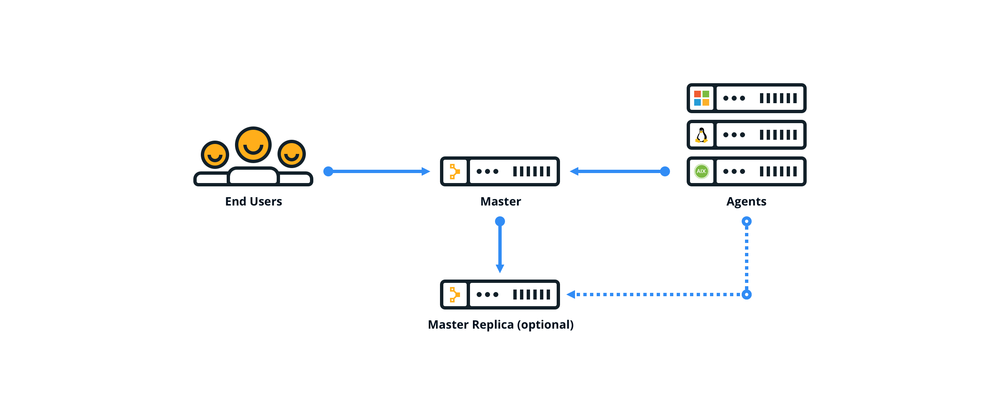
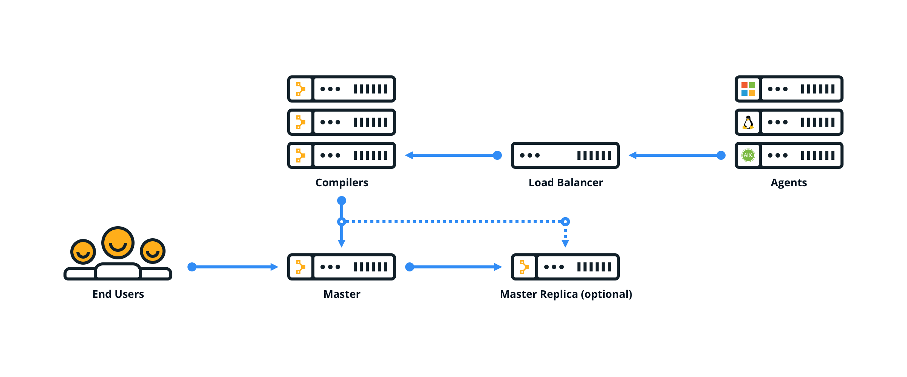
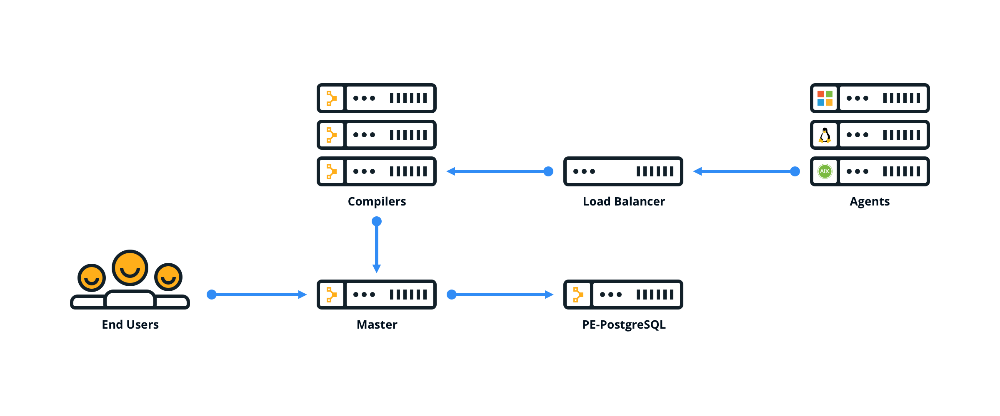

# Choosing an architecture

There are several configurations available for Puppet Enterprise. The configuration you use depends on the number of nodes in your environment and the resources required to serve agent catalogs.

|Configuration|Description|Node limit|
|-------------|-----------|----------|
|Standard installation \(Recommended\)|All infrastructure components are installed on the master. This installation type is the easiest to install, upgrade, and troubleshoot.|Up to 4,000|
|Large installation|Similar to a standard installation, plus one or more compilers and a load balancer which help distribute the agent catalog compilation workload.|4,000–20,000|
|Extra-large installation|Similar to a large installation, plus a separate node which hosts the PE-PostgreSQL instance.|More than 20,000|

**Tip:** You can add high availability to a installation with or without compilers by configuring a replica of your master. High availability isn't supported with standalone PE-PostgreSQL.

## Standard installation

## Large installation

## Extra-large installation

