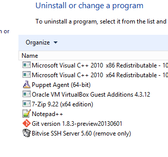

# Uninstall packages with Chocolatey

In addition to installing and creating packages, Chocolatey can also help you uninstall them.

## About this task

To verify that the choco `autoUninstaller` feature is turned on, use `choco feature` to list the features and their current state. If you're using `include chocolatey` or `class chocolatey` to ensure Chocolatey is installed, the configuration is applied automatically \(unless you have explicitly disabled it\). Starting in Chocolatey version `0.9.10`, it is enabled by default.

## Procedure

1.  If you see `autoUninstaller - [Disabled]`, you need to enable it. To do this, in the command prompt, run `choco feature enable -n autoUninstaller` You should see a similar success message:

    You should see a similar success message:

    ```
    Enabled autoUninstaller
    ```

2.  To remove Vagrant, edit your `chocolatey.pp` manifest to `ensure => absent`. Then save and validate the file.

    ```
    package {'vagrant':
      ensure   => absent,
      provider => chocolatey,
      source   => 'c:\packages',
    }
    ```

3.  Next, run `puppet apply <FILE PATH>\chocolatey.pp` to apply the manifest.

    ```
    Notice: Compiled catalog for win2012r2x64 in environment production in 0.75 seconds
    Notice: /Stage[main]/Main/Package[vagrant]/ensure: removed
    Notice: Applied catalog in 40.85 seconds
    ```


## Results

You can look in the Control Panel, Programs and Features to see that it’s no longer installed!



