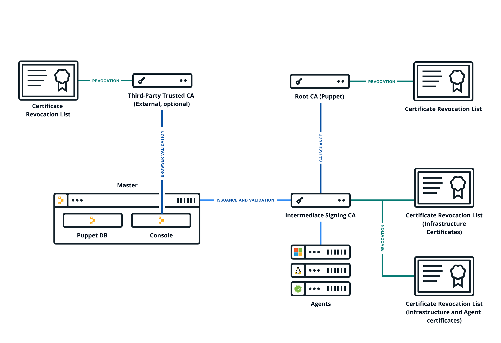

# Use a custom SSL certificate for the console

The console uses a certificate signed by PE's built-in certificate authority \(CA\). Because this CA is specific to PE, web browsers don't know it or trust it, and you have to add a security exception in order to access the console. You might find that this is not an acceptable scenario and want to use a custom CA to create the console's certificate.

-   You should have a X.509 cert, signed by the custom party CA, in PEM format, with matching private and public keys.
-   If your custom cert is issued by an intermediate CA, the CA bundle needs to contain a complete chain, including the applicable root CA.
-   The keys and certs used in this procedure must be in PEM format.



1.  Retrieve the custom certificate's public and private keys, and, for ease of use, name them as follows:

    -   console-cert.cert.pem
    -   console-cert.private\_key.pem
2.  Add the files from step 1 to `/opt/puppetlabs/server/data/console-services/certs/`.

3.  Restart the console and the nginx service for the changes to take effect.

    ```
    puppet resource service pe-console-services ensure=stopped
    puppet resource service pe-console-services ensure=running
    puppet resource service pe-nginx ensure=stopped
    puppet resource service pe-nginx ensure=running
    ```


You should now be able to navigate to your console and see the custom certificate in your browser.

