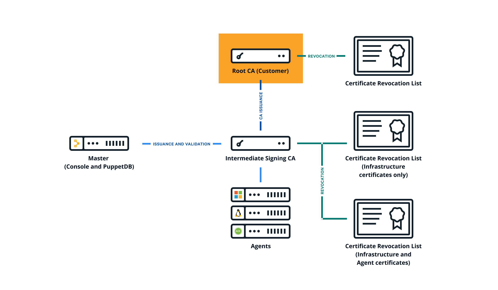

# Use an independent intermediate certificate authority

The built-in Puppet certificate authority automatically generates a root and intermediate certificate, but you can set up an independent intermediate certificate authority during installation if you need additional intermediate certificates, or if you prefer to use a public authority CA.

You must have a CA chain, a CRL chain, and a private key. The chains and key file must be PEM encoded and the CRL chain must be ordered from least to most authoritative, with the cert for the CA that you intend to use positioned first in the chain files.



1.  Copy your CA chain, CRL chain, and private key to the node where you're installing the master.

    **Tip:** Allow access to your private key only from the PE installation process, which runs as root.

2.  Follow the instructions to install PE in text mode, adding the `signing_ca` parameter to `pe.conf`.  

    You must include all three key/value pairs for the `signing_ca` parameter: `bundle`, `crl_chain`, and `private_key`. 

    ```
    {
     "pe_install::signing_ca": {
       "bundle": "/root/ca/int_ca_bundle"
       "crl_chain": "/root/ca/int_crl_chain"
       "private_key": "/root/ca/int_key"
     }
    }
    ```

3.  Validate that the CA is working using the standard openssl tools installed with PE.

    ```
    openssl x509 -in /etc/puppetlabs/puppet/ssl/ca/signed/<HOSTNAME>.crt 
    -text -noout
    Certificate:
       Data:
           Version: 3 (0x2)
           Serial Number: 1 (0x1)
       Signature Algorithm: sha256WithRSAEncryption
           Issuer: CN=intermediate-ca
    ...
    
    ```


